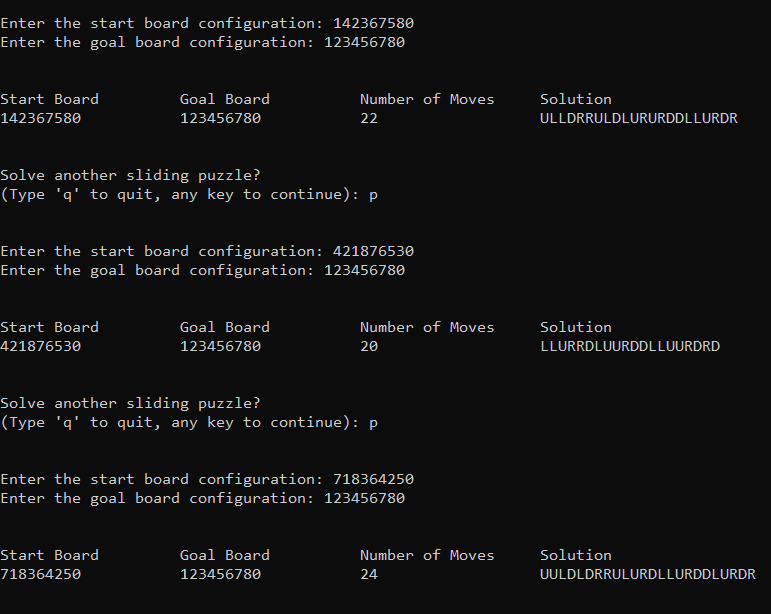

# Sliding Tiles
* Don Castillo  don.castillo@uleth.ca Student#: 001224541
* Term Project in CPSC 3620: Data Structures and Algorithm

download the repository from: https://github.com/DonCastillo/sliding-tiles.git

## ABOUT
This program provides a solution to a 3X3 sliding puzzle. <a href="/docs/project description.pdf">Full Description</a>.

## HOW TO USE THE PROGRAM

Enter two nine-character long string of digits (0 through 8) representing a 3x3 row-oriented layout of the initial and goal boards. The initial board is the start configuration of the sliding puzzle, and the goal boad is the configuration you want to solve.
E.g.

  *initial board*
  | 1 | 4 | 2 |
  |---|---|---|
  | 3 | 6 | 7 |
  | 5 | 8 | 0 |
  
  *initial board string configuration*
  142367580
  
  *goal board*
  | 1 | 2 | 3 |
  |---|---|---|
  | 4 | 5 | 6 |
  | 7 | 8 | 0 |
  
  *goal board string configuration*
  123456780
  
Once the string configurations of the initial and goal boards are entered, the program will determine what movements should the blank tile (represented by '0') take in order to get to the goal configuration. This is possible by computing the Manhattan Distance of each board configuration. A* search was implemented to get to the goal in a few moves possible.

Invalid configurations:

1. The configuration is not nine-characters long.
2. It has invalid characters (e.g. non-digit character, '9', space, other symbols).
3. There's no character '0'
4. There's a duplicate character

## HOW TO RUN/COMPILE THE PROGRAM
Go to the root directory of the local repository.
### Method 1: Using a make command
On the console, enter `make sliding-tiles` to build/compile the program. Then enter `sliding-tiles` to run the file generated in the directory.
### Method 2: Using Codeblocks IDE
Open the file `sliding-tiles.cbp`. To retrieve all necessary files, click on `Project` >  `Add Files Recursively`, and from there add all the files in the directory src/ and include/. src/ contains all the .cpp files and include/ contains all the header files. Also add the `main.cpp` file in the root directory.

Go to `Project` > `Build Options`, then select sliding-tiles that is in the left pane of the window. Click on the `Compiler Setting` and make sure that `Have g++ follow the C++11 ISO C++ language standard [-std=c++11]` is checked to make sure the program uses the imported libraries with no error. Also make sure that the selected compiler is `GNU GCC Compiler`.

## HOW TO DOWNLOAD FROM THE REPOSITORY

Using git, enter this command:

 `git clone https://github.com/DonCastillo/sliding-tiles.git`

The online repository is in public and can be accessed anywhere and by anyone.

